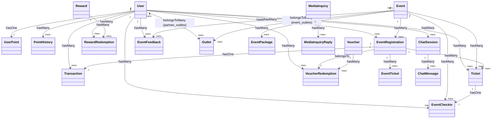

# DOKUMENTASI LOGIKA WEBSITE WISMILAK CIGARS
*Dokumen Persiapan Seminar Hasil / Sidang Skripsi*

---

## 1. Gambaran Umum Website
Website **Wismilak Cigars** dirancang sebagai media *digital engagement* terintegrasi untuk memperkuat hubungan antara brand dengan pelanggan setia dan mitra bisnis (partner). Fokus utama sistem ini adalah menyediakan platform informasi produk cerutu premium, lokasi outlet resmi, pressroom untuk publikasi berita perusahaan, pengelolaan event terintegrasi, program loyalitas pelanggan (loyalty points), penukaran poin dengan voucher/reward, chatbot otomatis, serta live chat interaktif.

Sistem ini menerapkan arsitektur berbasis peran (Role-Based Access Control) yang membagi akses pengguna ke dalam 4 peran utama:
1. **Admin**: Memiliki otoritas penuh atas seluruh konten website, verifikasi pendaftaran akun, pembuatan voucher dan reward, verifikasi event yang diajukan oleh Partner, verifikasi tiket QR check-in secara manual atau scanner, moderasi feedback, pengelolaan chatbot dan live chat, serta pengelolaan media inquiry.
2. **Manager**: Bertanggung jawab memantau performa bisnis dan analitik engagement website. Manager dapat mengakses dashboard berisi grafik perkembangan bulanan, ringkasan transaksi keuangan, ulasan rating feedback event, kinerja partner, serta mengunduh seluruh data laporan dalam format PDF dan CSV.
3. **Partner**: Merupakan perwakilan outlet resmi atau pihak ketiga yang berkolaborasi dengan Wismilak. Partner dapat mengajukan event baru (status draf ke pending approval), mengelola dan mengedit event miliknya sendiri, melihat daftar peserta event, memverifikasi check-in peserta menggunakan scanner QR code, serta mengunduh laporan detail event miliknya.
4. **Customer**: Pelanggan atau pengunjung website yang telah terverifikasi usia (minimal 21 tahun). Customer dapat menjelajahi katalog produk, mencari outlet terdekat via integrasi peta Leaflet.js, membaca pressroom, mendaftar event gratis maupun berbayar (integrasi payment gateway Midtrans Snap), mengunduh tiket elektronik berformat PDF dengan QR code unik, melakukan check-in di lokasi event, memberikan ulasan/feedback berhadiah poin, mengumpulkan poin loyalitas, serta menukarkannya dengan voucher diskon tiket atau reward merchandise.

---

## 2. Struktur Project Laravel
Aplikasi ini dibangun menggunakan framework Laravel dengan struktur direktori penting sebagai berikut:
* **`routes/`**: Berisi definisi rute URL.
  * [web.php](file:///c:/xamppp/htdocs/wismilakfinal/routes/web.php): Mengatur rute web untuk publik, customer, partner, manager, dan admin beserta pembatasan middleware-nya.
  * [auth.php](file:///c:/xamppp/htdocs/wismilakfinal/routes/auth.php): Rute bawaan Laravel Breeze untuk alur autentikasi (login, register, reset password, logout).
* **`app/Http/Controllers/`**: Menyimpan logika pengendali aplikasi yang menjembatani model dan view. Dibagi berdasarkan namespace/peran:
  * `Admin/`: Mengelola operasi CRUD data master oleh admin.
  * `Partner/`: Mengelola event dan check-in khusus partner.
  * `Manager/`: Mengatur pembuatan laporan dan analitik grafis.
  * `Customer/`: Mengelola dashboard customer, feedback, transaksi, dan riwayat poin.
* **`app/Models/`**: Menyimpan berkas model Eloquent yang merepresentasikan tabel-tabel di database serta mendefinisikan relasi antar-tabel.
* **`resources/views/`**: Folder template Blade untuk merender tampilan antarmuka (HTML). Terbagi menjadi subfolder `admin/`, `partner/`, `manager/`, `customer/`, `profile/`, dan `layouts/`.
* **`app/Http/Middleware/`**: Menyimpan filter HTTP untuk menyaring permintaan masuk:
  * [RoleMiddleware.php](file:///c:/xamppp/htdocs/wismilakfinal/app/Http/Middleware/RoleMiddleware.php): Membatasi hak akses halaman berdasarkan peran pengguna.
  * [AdminMiddleware.php](file:///c:/xamppp/htdocs/wismilakfinal/app/Http/Middleware/AdminMiddleware.php): Memastikan pengguna yang masuk memiliki peran admin.
  * [AgeVerificationMiddleware.php](file:///c:/xamppp/htdocs/wismilakfinal/app/Http/Middleware/AgeVerificationMiddleware.php): Memvalidasi apakah pengunjung sudah melewati gerbang verifikasi usia minimal 21 tahun.
* **`database/migrations/`**: Berisi file skema database untuk pembuatan tabel secara terstruktur.
* **`database/seeders/`**: Mengisi data awal ke database (seperti akun default admin, manager, partner, dan data master role).
* **`storage/`**: Menyimpan berkas unggahan dinamis seperti KTP peserta (`storage/app/public/ktp/`), poster event (`storage/app/public/events/`), avatar user (`storage/app/public/avatars/`), dan berkas galeri.
* **`public/`**: Menyimpan aset statis yang dapat diakses publik langsung seperti file CSS, JavaScript, gambar logo, dan library front-end (seperti Leaflet.js).
* **`config/`**: Menyimpan konfigurasi sistem seperti `services.php` (konfigurasi kunci API Midtrans) dan `app.php` (kunci enkripsi aplikasi).

---

## 3. Struktur Route
Rute didefinisikan dalam file [routes/web.php](file:///c:/xamppp/htdocs/wismilakfinal/routes/web.php) dan dikelompokkan menggunakan middleware proteksi:
1. **Public Routes (Bebas Akses)**:
   * `/` ([HomeController](file:///c:/xamppp/htdocs/wismilakfinal/app/Http/Controllers/HomeController.php)): Menampilkan beranda utama dengan event terdekat, produk terbaru, dan feeds Instagram.
   * `/age-verification` & `/age-verify` ([AgeVerificationController](file:///c:/xamppp/htdocs/wismilakfinal/app/Http/Controllers/AgeVerificationController.php)): Mengelola halaman gerbang batas usia 21+.
   * `/products` & `/products/{product}` ([CustomerProductController](file:///c:/xamppp/htdocs/wismilakfinal/app/Http/Controllers/ProductController.php)): Katalog dan detail spesifikasi produk cerutu.
   * `/outlets` & `/outlets/{outlet}` ([CustomerOutletController](file:///c:/xamppp/htdocs/wismilakfinal/app/Http/Controllers/OutletController.php)): Peta persebaran outlet dan detail outlet.
   * `/pressroom` & `/pressroom/{slug}` ([CustomerPressroomController](file:///c:/xamppp/htdocs/wismilakfinal/app/Http/Controllers/PressroomController.php)): Berita publikasi dan pengiriman inquiry media.
   * `/events` & `/events/{event}` ([CustomerEventController](file:///c:/xamppp/htdocs/wismilakfinal/app/Http/Controllers/EventController.php)): Melihat kalender dan detail event.
2. **Authenticated Routes (Semua Pengguna Terlogin)**:
   Dibungkus dalam `Route::middleware('auth')`.
   * `/dashboard`: Mengarahkan pengguna secara dinamis ke dashboard masing-masing sesuai perannya (Admin, Manager, Partner, Customer) menggunakan pencocokan `match`.
   * `/profile/manage`: Pengaturan profil bersama (ubah nama, email, nomor HP, foto profil).
   * `/notifications`: Melihat daftar notifikasi sistem dan menandainya sebagai dibaca.
3. **Customer Routes (Khusus Customer)**:
   Dibungkus dalam `Route::middleware(['auth', 'role:customer'])` dengan awalan `/customer`.
   * `/dashboard`: Menampilkan poin, event terdaftar, voucher aktif, tombol penukaran voucher/reward.
   * `/voucher/{voucher}/redeem` & `/reward/{reward}/redeem`: Penukaran poin loyalty.
   * `/payment/{registration}`: Halaman pembayaran Snap token Midtrans.
   * `/transactions`: Riwayat pendaftaran event dan status transaksi.
   * `/event/{event}/feedback`: Mengisi survei feedback pasca-event.
4. **Partner Routes (Khusus Partner)**:
   Dibungkus dalam `Route::middleware(['auth', 'role:partner'])` dengan awalan `/partner`.
   * `/dashboard`: Statistik ringkas event milik partner.
   * `events` (Resource): Mengelola CRUD draf pengajuan event milik partner.
   * `/checkin/scan` & `/checkin/process`: Halaman scanner tiket QR code peserta di lokasi event.
5. **Manager Routes (Khusus Manager)**:
   Dibungkus dalam `Route::middleware(['auth', 'role:manager'])` dengan awalan `/manager`.
   * Halaman dashboard analitik performa bisnis.
   * Rute index dan ekspor laporan PDF/CSV untuk data Transaksi, Event, User, Reward, Engagement, Feedback, Partner, dan Customer.
6. **Admin Routes (Khusus Admin)**:
   Dibungkus dalam `Route::middleware(['auth', 'role:admin'])` dengan awalan `/admin`.
   * `/event/verification`: Verifikasi dan approval event yang diajukan Partner.
   * `/event-participants`: Pemantauan kehadiran peserta event, pengunduhan tiket PDF cadangan.
   * `/checkin/scan`: Fitur scanner QR check-in alternatif milik admin.
   * Pengelolaan CRUD master data: `product` (produk), `pressroom` (berita), `outlets` (outlet + hubungan partner & ketersediaan produk), `users` (pengguna + aktivasi/non-aktivasi), `points/rewards` (merchandise), `vouchers` (voucher diskon), `chat-topics` (kata kunci chatbot).

---

## 4. Struktur Controller
Berikut adalah daftar pengendali (controller) penting yang memproses logika bisnis sistem:

### A. Customer Controllers
1. **[DashboardController](file:///c:/xamppp/htdocs/wismilakfinal/app/Http/Controllers/Customer/DashboardController.php)**:
   * *Fungsi*: Menampilkan dasbor ringkas poin loyalty, voucher aktif, riwayat penukaran poin, dan form penukaran reward/voucher.
   * *Method Penting*: `index()` (memuat data statistik dasbor), `redeemVoucher()` (logika pengurangan poin untuk mendapatkan kode voucher diskon baru), `redeemReward()` (mengurangi poin dan stok merchandise dengan status pending), `myVouchers()` (menampilkan voucher yang dimiliki), `pointHistory()` (memuat riwayat keluar-masuk poin).
   * *Data DB*: `User`, `Voucher`, `Reward`, `VoucherRedemption`, `RewardRedemption`, `PointHistory`.
   * *View*: `customer.dashboard`, `customer.vouchers.index`, `customer.points.history`.
2. **[TransactionController](file:///c:/xamppp/htdocs/wismilakfinal/app/Http/Controllers/Customer/TransactionController.php)**:
   * *Fungsi*: Menampilkan riwayat pemesanan tiket event oleh customer.
   * *Method Penting*: `index()` (menampilkan daftar registrasi berpaginasi), `show()` (menampilkan detail transaksi, status Midtrans, data tiket, dan status kehadiran check-in).
   * *Data DB*: `EventRegistration`, `Transaction`, `EventFeedback`.
   * *View*: `customer.transactions.index`, `customer.transactions.show`.
3. **[FeedbackController](file:///c:/xamppp/htdocs/wismilakfinal/app/Http/Controllers/Customer/FeedbackController.php)**:
   * *Fungsi*: Logika pengisian ulasan pasca-kehadiran event.
   * *Method Penting*: `create()` (menampilkan form rating bintang 1-5, komentar, upload gambar), `store()` (menyimpan feedback, menghitung jumlah tiket ter-check-in, memberikan reward poin kelipatan 15 per tiket, mencatat riwayat poin, memicu notifikasi admin & partner), `history()`, `edit()`, `update()`.
   * *Data DB*: `Event`, `EventFeedback`, `EventRegistration`, `Ticket`, `PointHistory`.
   * *View*: `customer.feedback.create`, `customer.feedback.history`, `customer.feedback.edit`, `customer.feedback.show`.

### B. Partner Controllers
1. **[PartnerEventController](file:///c:/xamppp/htdocs/wismilakfinal/app/Http/Controllers/Partner/EventController.php)**:
   * *Fungsi*: Mengelola siklus hidup event yang diselenggarakan oleh partner.
   * *Method Penting*: `index()` (daftar event milik partner bersangkutan), `store()` & `update()` (validasi dan simpan data draf event), `submit()` (mengubah status event dari draf ke 'pending' untuk diverifikasi admin), `participants()` (melihat daftar peserta), `feedbacks()` (melihat review event), `exportEventPdf()` / `exportEventCsv()` (mengunduh data kehadiran).
   * *Data DB*: `Event`, `Outlet`, `EventRegistration`, `EventFeedback`, `EventCheckin`.
   * *View*: `partner.events.*` (index, create, edit, show, participants, feedbacks, checkins).
2. **[PartnerCheckinController](file:///c:/xamppp/htdocs/wismilakfinal/app/Http/Controllers/Partner/CheckinController.php)**:
   * *Fungsi*: Memproses scanner check-in kehadiran di lokasi event milik partner.
   * *Method Penting*: `scan()` (halaman kamera scanner Leaflet/HTML5), `process()` (validasi keaslian QR code, memverifikasi hash keamanan, menandai tiket sebagai `checked_in`, memberikan +10 poin loyalty ke user, mengirim notifikasi real-time).
   * *Data DB*: `Ticket`, `EventCheckin`, `PointHistory`, `Notification`.
   * *View*: `partner.checkin.scan`.

### C. Manager Controllers
1. **[ReportController](file:///c:/xamppp/htdocs/wismilakfinal/app/Http/Controllers/Manager/ReportController.php)**:
   * *Fungsi*: Logika pembuatan laporan analitik performa sistem.
   * *Method Penting*: `dashboard()` (menghitung statistik total pendapatan, rata-rata rating feedback, performa partner, grafik transaksi bulanan), `events()`, `users()`, `transactions()`, `rewards()`, `engagement()`, `feedbacks()`, `partners()`, `customers()` beserta masing-masing fungsi ekspor data PDF (menggunakan DomPDF) dan CSV.
   * *Data DB*: `Event`, `User`, `Transaction`, `RewardRedemption`, `EventFeedback`, `PointHistory`, `Outlet`.
   * *View*: `manager.dashboard`, `manager.events.index`, `manager.users.index`, `manager.transactions.index`, `manager.rewards.index`, `manager.engagement.index`, `manager.feedback.index`, `manager.partners.index`, `manager.customers.index`.

### D. Admin Controllers
1. **[AdminDashboardController](file:///c:/xamppp/htdocs/wismilakfinal/app/Http/Controllers/Admin/DashboardController.php)**:
   * *Fungsi*: Menampilkan ringkasan data total event, pendapatan kotor dari transaksi berbayar, total pengguna terdaftar, dan jumlah sesi live chat yang sedang aktif.
   * *Method Penting*: `index()`.
   * *Data DB*: `Event`, `EventRegistration`, `Transaction`, `User`, `ChatSession`.
   * *View*: `admin.dashboard`.
2. **[AdminEventController](file:///c:/xamppp/htdocs/wismilakfinal/app/Http/Controllers/Admin/EventController.php)**:
   * *Fungsi*: CRUD event yang dibuat langsung oleh admin (otomatis status approved & published).
   * *Method Penting*: `store()` (mengunggah poster, menyimpan daftar privilege package, mendaftarkan outlet terkait, memicu notifikasi manager).
   * *Data DB*: `Event`, `Outlet`, `Notification`.
   * *View*: `admin.event.index`, `admin.event.create`, `admin.event.edit`.
3. **[EventVerificationController](file:///c:/xamppp/htdocs/wismilakfinal/app/Http/Controllers/Admin/EventVerificationController.php)**:
   * *Fungsi*: Memvalidasi dan menyetujui event yang diajukan oleh Partner.
   * *Method Penting*: `verify()` (mengubah status menjadi 'approved'), `reject()` (mengubah status menjadi 'rejected' disertai catatan alasan), `publish()` (mempublikasikan event agar bisa dilihat customer), `unpublish()` (menyembunyikan event dari kalender customer).
   * *Data DB*: `Event`, `Notification`.
   * *View*: `admin.event.verification`.
4. **[EventParticipantController](file:///c:/xamppp/htdocs/wismilakfinal/app/Http/Controllers/Admin/EventParticipantController.php)**:
   * *Fungsi*: Memantau seluruh daftar peserta event terdaftar.
   * *Method Penting*: `show()` (daftar pendaftar berstatus paid), `participantDetail()` (melihat berkas KTP peserta dan detail transaksi), `downloadTicket()` (mencetak tiket PDF dari sisi admin).
   * *Data DB*: `Event`, `EventRegistration`, `Ticket`, `EventTicket`.
   * *View*: `admin.event.participants.index`, `admin.event.participants.detail`, `admin.event.participants.participant-detail`.
5. **[VoucherController](file:///c:/xamppp/htdocs/wismilakfinal/app/Http/Controllers/Admin/VoucherController.php)**:
   * *Fungsi*: Pengelolaan gabungan voucher diskon poin dan reward merchandise.
   * *Method Penting*: `index()` (menggabungkan koleksi Voucher dan Reward dalam satu tabel paginasi), `store()` (membuat voucher baru dengan kode berawalan `WSMK-` atau membuat item reward baru), `update()`, `destroy()`.
   * *Data DB*: `Voucher`, `Reward`.
   * *View*: `admin.vouchers.index`, `admin.vouchers.create`, `admin.vouchers.edit`.
6. **[LiveChatController](file:///c:/xamppp/htdocs/wismilakfinal/app/Http/Controllers/Admin/LiveChatController.php)**:
   * *Fungsi*: Mengelola komunikasi real-time dengan customer yang melakukan eskalasi dari bot.
   * *Method Penting*: `index()` (daftar sesi chat aktif open/closed), `show()` (memuat obrolan terpilih), `reply()` (mengirim pesan balasan admin dan mengirimkan notifikasi ke HP customer), `close()` (menutup sesi chat), `analytics()` (analitik pesan bot vs admin, perhitungan kata kunci terpopuler).
   * *Data DB*: `ChatSession`, `ChatMessage`, `Notification`.
   * *View*: `admin.livechat.index`, `admin.livechat.show`, `admin.livechat.analytics`.
7. **[ChatTopicController](file:///c:/xamppp/htdocs/wismilakfinal/app/Http/Controllers/Admin/ChatTopicController.php)**:
   * *Fungsi*: Pengelolaan kata kunci (keyword) pencocokan respons otomatis chatbot.
   * *Method Penting*: `store()`, `update()`, `seedDefaults()` (menghapus tabel dan menanamkan data default respon chat chatbot seperti info event, poin, voucher, pembayaran, lokasi outlet, dan trigger eskalasi admin).
   * *Data DB*: `ChatTopic`.
   * *View*: `admin.chat-topics.index`, `admin.chat-topics.create`, `admin.chat-topics.edit`.
8. **[MediaInquiryController](file:///c:/xamppp/htdocs/wismilakfinal/app/Http/Controllers/Admin/MediaInquiryController.php)**:
   * *Fungsi*: Mengelola formulir pertanyaan media (media inquiry) dari jurnalis atau pengunjung.
   * *Method Penting*: `index()` (memuat daftar inquiry masuk, filter unread/unreplied), `show()` (menandai status dibaca), `reply()` (menyimpan pesan balasan ke database dan mengirim email formal balasan menggunakan Mailable `MediaInquiryReplyMail`).
   * *Data DB*: `MediaInquiry`, `MediaInquiryReply`, `Notification`.
   * *View*: `admin.media_inquiries.index`, `admin.media_inquiries.show`.

### E. Shared & Public Controllers
1. **[AgeVerificationController](file:///c:/xamppp/htdocs/wismilakfinal/app/Http/Controllers/AgeVerificationController.php)**:
   * *Fungsi*: Mengontrol gerbang utama pembatasan usia pengguna.
   * *Method Penting*: `verify()` (jika dikirim `verified == 1`, set variabel session `age_verified` menjadi `true` dan redirect ke home. Jika gagal/memilih usia di bawah 21, redirect ke Google).
   * *View*: `auth.age-verification`.
2. **[HomeController](file:///c:/xamppp/htdocs/wismilakfinal/app/Http/Controllers/HomeController.php)**:
   * *Fungsi*: Mengontrol tampilan beranda utama website customer.
   * *Method Penting*: `index()` (mengecek kadaluarsa event lewat `Event::autoUpdateStatuses()`, memuat slider galeri aktif, 6 produk cerutu terbaru, 6 event mendatang terdekat, dan postingan feeds Instagram).
   * *Data DB*: `Event`, `Gallery`, `Product`, `InstagramPost`.
   * *View*: `customer.home`.
3. **[EventRegistrationController](file:///c:/xamppp/htdocs/wismilakfinal/app/Http/Controllers/EventRegistrationController.php)** (Shared Customer/Auth):
   * *Fungsi*: Menangani pendaftaran peserta event interaktif beserta pembayaran.
   * *Method Penting*: `create()` (cek batasan status event dan kuota, muat voucher diskon yang dimiliki user), `store()` (validasi data KTP dan usia minimal 21 tahun untuk seluruh tiket yang dibeli, hitung potongan harga voucher, proses pembayaran gratis langsung terbit tiket atau generate Snap token Midtrans untuk event berbayar), `payment()`, `paymentSuccess()` (fallback sinkronisasi status pembayaran via API Midtrans jika webhook tertunda).
   * *Data DB*: `Event`, `EventRegistration`, `EventTicket`, `Ticket`, `VoucherRedemption`, `PointHistory`, `Transaction`.
   * *View*: `customer.events.register`, `customer.events.payment`.
4. **[MidtransNotificationController](file:///c:/xamppp/htdocs/wismilakfinal/app/Http/Controllers/MidtransNotificationController.php)** (Shared Webhook):
   * *Fungsi*: Webhook otomatis dari server Midtrans untuk sinkronisasi status pembayaran tiket.
   * *Method Penting*: `handleNotification()` (menerima payload JSON dari Midtrans, memverifikasi tanda tangan SHA512 menggunakan server key untuk keamanan data), `processSuccessPayment()` (menjalankan transaksi database untuk mengunci kuota event (`lockForUpdate`), memotong kuota event, mengubah status pendaftaran menjadi paid, menerbitkan nomor tiket unik beserta QR code, menandai voucher telah terpakai, dan memberikan reward +10 poin loyalty per tiket berbayar).
   * *Data DB*: `EventRegistration`, `Event`, `Ticket`, `VoucherRedemption`, `Transaction`, `PointHistory`.
5. **[ProfileManagementController](file:///c:/xamppp/htdocs/wismilakfinal/app/Http/Controllers/ProfileManagementController.php)** (Shared Profil):
   * *Fungsi*: Logika bersama pembaruan profil pengguna untuk seluruh peran.
   * *Method Penting*: `update()` (memperbarui nama, email, nomor HP, dan mengunggah foto profil yang kemudian dialokasikan ke tabel profil spesifik peran seperti `admin_profiles`, `customer_profiles`, `partner_profiles`, atau `manager_profiles`).

---

## 5. Struktur Model dan Database
Berikut adalah struktur data dan relasi antar model Eloquent yang ada di dalam folder `app/Models/`:



### Penjelasan Detail Model:
1. **[User](file:///c:/xamppp/htdocs/wismilakfinal/app/Models/User.php)** (Tabel: `users`)
   * *Atribut Penting*: `name`, `email`, `password`, `role_id`, `status` (active/inactive), `phone`, `date_of_birth`, `city`, `gender`.
   * *Relasi*: `belongsTo(Role)`, `hasOne(UserPoint)`, `hasMany(PointHistory)`, `hasMany(EventRegistration)`, `hasMany(Transaction)`, `hasMany(Ticket)`, `belongsToMany(Outlet, 'partner_outlets')`.
   * *Fungsi*: Representasi akun pengguna utama dalam sistem.
2. **[Role](file:///c:/xamppp/htdocs/wismilakfinal/app/Models/Role.php)** (Tabel: `roles`)
   * *Atribut Penting*: `name` (admin, manager, partner, customer), `display_name`.
   * *Relasi*: `hasMany(User)`.
   * *Fungsi*: Pengaturan hak akses peran dalam sistem.
3. **[Event](file:///c:/xamppp/htdocs/wismilakfinal/app/Models/Event.php)** (Tabel: `events`)
   * *Atribut Penting*: `title`, `date`, `start_time`, `end_time`, `quota`, `remaining_quota`, `location`, `price_type` (free/paid), `price`, `image` (poster), `status` (draft, pending, approved, rejected, published, quota_full, completed), `created_by`, `verification_status`.
   * *Relasi*: `hasMany(EventRegistration)`, `hasMany(Ticket)`, `belongsToMany(Outlet, 'event_outlets')`, `hasMany(EventPackage, 'event_id')`, `hasMany(EventFeedback)`.
   * *Fungsi*: Menyimpan informasi detail acara yang dibuat Admin atau diajukan Partner.
4. **[EventRegistration](file:///c:/xamppp/htdocs/wismilakfinal/app/Models/EventRegistration.php)** (Tabel: `event_registrations`)
   * *Atribut Penting*: `event_id`, `user_id`, `quantity`, `ticket_price`, `total_amount`, `payment_status` (pending, paid, failed, expired), `snap_token`, `expired_at`, `voucher_redemption_id`.
   * *Relasi*: `belongsTo(Event)`, `belongsTo(User)`, `hasMany(EventTicket, 'registration_id')`, `hasMany(Ticket)`, `hasOne(Transaction)`, `belongsTo(VoucherRedemption)`.
   * *Fungsi*: Menyimpan data reservasi tiket sebelum pembayaran divalidasi.
5. **[EventTicket](file:///c:/xamppp/htdocs/wismilakfinal/app/Models/EventTicket.php)** (Tabel: `event_tickets`)
   * *Atribut Penting*: `registration_id`, `full_name`, `email`, `phone`, `date_of_birth`, `ktp_number`, `ktp_file`.
   * *Relasi*: `belongsTo(EventRegistration, 'registration_id')`.
   * *Fungsi*: Menyimpan data formulir KTP dan nama masing-masing peserta (khusus alur multi-tiket).
6. **[Ticket](file:///c:/xamppp/htdocs/wismilakfinal/app/Models/Ticket.php)** (Tabel: `tickets`)
   * *Atribut Penting*: `ticket_number`, `event_registration_id`, `user_id`, `event_id`, `full_name`, `email`, `phone`, `date_of_birth`, `ktp_number`, `status` (active, checked_in, expired).
   * *Relasi*: `belongsTo(EventRegistration)`, `belongsTo(User)`, `belongsTo(Event)`, `hasOne(EventCheckin)`.
   * *Fungsi*: Tiket elektronik resmi yang memuat kode unik dan data QR untuk check-in.
7. **[Transaction](file:///c:/xamppp/htdocs/wismilakfinal/app/Models/Transaction.php)** (Tabel: `transactions`)
   * *Atribut Penting*: `registration_id`, `user_id`, `amount`, `payment_method` (gopay, shopeepay, bank_transfer, free, dll), `transaction_code`, `status` (pending, paid, failed), `paid_at`, `gateway_response`.
   * *Relasi*: `belongsTo(EventRegistration)`, `belongsTo(User)`.
   * *Fungsi*: Pencatatan mutasi keuangan riil yang divalidasi sistem.
8. **[EventCheckin](file:///c:/xamppp/htdocs/wismilakfinal/app/Models/EventCheckin.php)** (Tabel: `event_checkins`)
   * *Atribut Penting*: `ticket_id`, `user_id`, `event_id`, `checked_in_at`, `points_awarded`.
   * *Relasi*: `belongsTo(Ticket)`, `belongsTo(User)`, `belongsTo(Event)`.
   * *Fungsi*: Mencatat riwayat waktu kehadiran peserta di lokasi acara dan poin yang diberikan.
9. **[Voucher](file:///c:/xamppp/htdocs/wismilakfinal/app/Models/Voucher.php)** (Tabel: `vouchers`)
   * *Atribut Penting*: `code`, `title`, `description`, `discount_type` (percentage/fixed), `discount_value`, `max_discount`, `min_purchase`, `max_uses`, `used_count`, `points_required`, `valid_from`, `valid_until`, `status` (active/inactive).
   * *Relasi*: `hasMany(VoucherRedemption)`.
   * *Fungsi*: Template voucher potongan harga yang dapat ditukarkan customer menggunakan poin loyalty.
10. **[VoucherRedemption](file:///c:/xamppp/htdocs/wismilakfinal/app/Models/VoucherRedemption.php)** (Tabel: `voucher_redemptions`)
    * *Atribut Penting*: `voucher_id`, `user_id`, `points_spent`, `voucher_code` (kode unik acak baru milik user), `status` (unused, used, expired), `redeemed_at`, `expired_at`.
    * *Relasi*: `belongsTo(Voucher)`, `belongsTo(User)`.
    * *Fungsi*: Menyimpan kode voucher unik milik customer hasil penukaran poin yang siap digunakan saat registrasi event.
11. **[UserPoint](file:///c:/xamppp/htdocs/wismilakfinal/app/Models/UserPoint.php)** (Tabel: `user_points`)
    * *Atribut Penting*: `user_id`, `total_points`.
    * *Relasi*: `belongsTo(User)`.
    * *Fungsi*: Menyimpan saldo poin loyalty saat ini yang dikumpulkan customer.
12. **[PointHistory](file:///c:/xamppp/htdocs/wismilakfinal/app/Models/PointHistory.php)** (Tabel: `point_histories`)
    * *Atribut Penting*: `user_id`, `points` (jumlah poin yang didapat/dibelanjakan), `type` (earn/spend), `source` (event_registration, event_payment, checkin, feedback, voucher_redemption, reward_redemption), `reference_id`, `description`.
    * *Relasi*: `belongsTo(User)`.
    * *Fungsi*: Log histori mutasi saldo poin pelanggan untuk menjaga transparansi audit poin.
13. **[Reward](file:///c:/xamppp/htdocs/wismilakfinal/app/Models/Reward.php)** (Tabel: `rewards`)
    * *Atribut Penting*: `title`, `description`, `points_required`, `stock`, `image`, `status` (active/inactive).
    * *Relasi*: `hasMany(RewardRedemption)`.
    * *Fungsi*: Data barang merchandise fisik yang ditawarkan untuk ditukar dengan poin.
14. **[RewardRedemption](file:///c:/xamppp/htdocs/wismilakfinal/app/Models/RewardRedemption.php)** (Tabel: `reward_redemptions`)
    * *Atribut Penting*: `user_id`, `reward_id`, `points_used`, `status` (pending, processed, completed, cancelled).
    * *Relasi*: `belongsTo(User)`, `belongsTo(Reward)`.
    * *Fungsi*: Mencatat transaksi klaim merchandise fisik yang harus diproses oleh admin/staf pengirim barang.
15. **[EventFeedback](file:///c:/xamppp/htdocs/wismilakfinal/app/Models/EventFeedback.php)** (Tabel: `event_feedbacks`)
    * *Atribut Penting*: `event_id`, `user_id`, `rating` (1-5), `comment`, `image` (foto dokumentasi kesaksian customer), `points_awarded`.
    * *Relasi*: `belongsTo(Event)`, `belongsTo(User)`.
    * *Fungsi*: Menyimpan survei penilaian kepuasan peserta setelah menghadiri event.
16. **[ChatSession](file:///c:/xamppp/htdocs/wismilakfinal/app/Models/ChatSession.php)** (Tabel: `chat_sessions`)
    * *Atribut Penting*: `user_id`, `name`, `email`, `status` (open, closed), `mode` (bot, live), `assigned_at`, `needs_admin` (boolean).
    * *Relasi*: `belongsTo(User)`, `hasMany(ChatMessage)`.
    * *Fungsi*: Menyimpan sesi obrolan interaktif customer, memisahkan penanganan antara Chatbot otomatis dan Live Chat Admin.
17. **[ChatMessage](file:///c:/xamppp/htdocs/wismilakfinal/app/Models/ChatMessage.php)** (Tabel: `chat_messages`)
    * *Atribut Penting*: `chat_session_id`, `sender` (user, bot, admin), `message`.
    * *Relasi*: `belongsTo(ChatSession)`.
    * *Fungsi*: Menyimpan pesan-pesan obrolan dalam suatu sesi chat.
18. **[ChatTopic](file:///c:/xamppp/htdocs/wismilakfinal/app/Models/ChatTopic.php)** (Tabel: `chat_topics`)
    * *Atribut Penting*: `keyword` (kata kunci yang dicocokkan koma-terpisah), `response` (teks balasan chatbot), `category`, `is_escalation` (boolean), `sort_order`, `is_active` (boolean).
    * *Relasi*: Tidak memiliki relasi langsung.
    * *Fungsi*: Kamus basis data kata kunci untuk penentuan jawaban otomatis chatbot.
19. **[Product](file:///c:/xamppp/htdocs/wismilakfinal/app/Models/Product.php)** (Tabel: `products`)
    * *Atribut Penting*: `name`, `image_main`, `image_detail`, `short_description`, `description`, `weight`, `wrapper`, `filler`, `size`, `status` (1 = aktif, 0 = nonaktif).
    * *Relasi*: `belongsToMany(Outlet, 'outlet_products')`.
    * *Fungsi*: Menyimpan data katalog cerutu Wismilak beserta spesifikasi fisiknya.
20. **[Outlet](file:///c:/xamppp/htdocs/wismilakfinal/app/Models/Outlet.php)** (Tabel: `outlets`)
   * *Atribut Penting*: `name`, `address`, `region`, `city`, `latitude`, `longitude`, `phone`, `opening_hours`, `status` (active/inactive).
   * *Relasi*: `belongsToMany(User, 'partner_outlets', 'outlet_id', 'partner_id')` (relasi partner penanggung jawab), `belongsToMany(Product, 'outlet_products')` (ketersediaan stok cerutu), `belongsToMany(Event, 'event_outlets')`.
   * *Fungsi*: Menyimpan informasi titik koordinat GPS dan data operasional toko fisik/outlet.
21. **[Pressroom](file:///c:/xamppp/htdocs/wismilakfinal/app/Models/Pressroom.php)** (Tabel: `pressrooms`)
    * *Atribut Penting*: `title`, `slug`, `image`, `excerpt`, `content`, `published_at`, `status` (draft/publish).
    * *Fungsi*: Menyimpan artikel rilis pers dan berita resmi Wismilak.
22. **[MediaInquiry](file:///c:/xamppp/htdocs/wismilakfinal/app/Models/MediaInquiry.php)** (Tabel: `media_inquiries`)
    * *Atribut Penting*: `name`, `email`, `phone`, `organization`, `subject`, `inquiry_type`, `message`, `is_read` (boolean).
    * *Relasi*: `hasMany(MediaInquiryReply)`.
    * *Fungsi*: Menampung pertanyaan dari media luar atau jurnalis yang dikirim via website.
23. **[MediaInquiryReply](file:///c:/xamppp/htdocs/wismilakfinal/app/Models/MediaInquiryReply.php)** (Tabel: `media_inquiry_replies`)
    * *Atribut Penting*: `media_inquiry_id`, `message`.
    * *Relasi*: `belongsTo(MediaInquiry)`.
    * *Fungsi*: Log tanggapan balasan yang dikirim admin ke email penanya media inquiry.
24. **[InstagramPost](file:///c:/xamppp/htdocs/wismilakfinal/app/Models/InstagramPost.php)** (Tabel: `instagram_posts`)
    * *Atribut Penting*: `image_path`, `instagram_url`, `caption`, `sort_order`, `status` (active/inactive).
    * *Fungsi*: Menyimpan data postingan Instagram tiruan untuk diintegrasikan di beranda utama.
25. **[Gallery](file:///c:/xamppp/htdocs/wismilakfinal/app/Models/Gallery.php)** (Tabel: `galleries`)
    * *Atribut Penting*: `image`, `caption`, `category`, `status` (tampil/sembunyi).
    * *Fungsi*: Dokumentasi visual Wismilak Cigars yang ditampilkan di slider halaman utama (*Rutenya di-comment out dalam routes/web.php, tetapi model dan view-nya siap pakai*).

---

## 6. Alur Autentikasi dan Role
Proses autentikasi didukung penuh oleh Laravel Breeze dengan modifikasi alur peran:
1. **Pendaftaran (Register)**:
   * Pengunjung mendaftar di rute `/register` ([RegisteredUserController](file:///c:/xamppp/htdocs/wismilakfinal/app/Http/Controllers/Auth/RegisteredUserController.php)).
   * Secara default, pengguna baru yang mendaftar mandiri via web akan mendapatkan peran `customer` (mengacu pada pencarian nama peran 'customer' di tabel `roles` untuk mendapatkan ID-nya).
   * Status akun baru diatur sebagai `active`.
2. **Masuk (Login)**:
   * Autentikasi kredensial email dan password divalidasi di `/login` ([AuthenticatedSessionController](file:///c:/xamppp/htdocs/wismilakfinal/app/Http/Controllers/Auth/AuthenticatedSessionController.php)).
   * Sebelum login berhasil, sistem memverifikasi status akun di database. Jika status bernilai `inactive` (dinonaktifkan oleh admin), proses login ditolak dan mengembalikan pesan error.
3. **Smart Redirect Dashboard**:
   * Setelah masuk, pengguna diarahkan ke `/dashboard`.
   * Sistem membaca relasi peran user login (`auth()->user()->role->name`) dan melakukan pengalihan otomatis:
     * `'admin'` $\rightarrow$ `redirect()->route('admin.dashboard')`
     * `'manager'` $\rightarrow$ `redirect()->route('manager.dashboard')`
     * `'partner'` $\rightarrow$ `redirect()->route('partner.dashboard')`
     * Lainnya/Customer $\rightarrow$ `redirect()->route('customer.dashboard')`
4. **Pembatasan Halaman (Role & Age Middleware)**:
   * **[AgeVerificationMiddleware](file:///c:/xamppp/htdocs/wismilakfinal/app/Http/Middleware/AgeVerificationMiddleware.php)**: Didaftarkan secara global pada grup rute web. Setiap pengunjung yang mengakses website pertama kali wajib memasukkan status verifikasi usia. Jika variabel sesi `age_verified` bernilai `false` atau kosong, sistem memaksa redirect ke `/age-verification` (kecuali rute verifikasi itu sendiri). Pengguna di bawah 21 tahun akan diredirect keluar ke Google.
   * **[RoleMiddleware](file:///c:/xamppp/htdocs/wismilakfinal/app/Http/Middleware/RoleMiddleware.php)**: Menggunakan parameter variadik `...$roles` di rute-rute khusus. Middleware mengecek apakah `Auth::user()->hasRole($role)` sesuai dengan daftar peran yang diperbolehkan. Jika tidak sesuai, sistem membatalkan akses dengan kode status HTTP `403 (Unauthorized)`.

---

## 7. Logika Sistem Admin
Admin bertindak sebagai administrator sistem dengan fungsionalitas berikut:
* **Dashboard Admin**:
   * Menampilkan data ringkas total event terdaftar, total user terdaftar, total pendapatan kotor dari transaksi berbayar (`Transaction::where('status', 'paid')->sum('amount')`), total chat yang sedang aktif open, dan grafik pendapatan bulanan dari kueri 6 bulan terakhir.
   * Controller: `Admin\DashboardController`. Tabel terlibat: `events`, `users`, `transactions`, `chat_sessions`.
* **Kelola Event & Verifikasi Event Partner**:
   * Admin memiliki wewenang CRUD penuh untuk event yang diselenggarakan langsung oleh Admin (berstatus otomatis approved/published).
   * Event yang dibuat oleh **Partner** masuk sebagai status draf, kemudian dikirim partner untuk verifikasi. Admin dapat memantau daftar pengajuan di halaman `/admin/event/verification`.
   * Admin dapat menekan tombol **Verify** (mengubah status event menjadi 'approved') atau tombol **Reject** (mengubah status menjadi 'rejected' dengan catatan).
   * Setelah disetujui ('approved'), admin mempublikasikan event tersebut via tombol **Publish** (status berubah dari 'approved' menjadi 'published') agar tampil di kalender event pelanggan.
   * Controller: `Admin\EventController` dan `Admin\EventVerificationController`. Tabel terlibat: `events`, `event_packages`, `event_outlets`, `notifications`.
* **Kelola Peserta Event**:
   * Admin memantau daftar kehadiran per event. Admin dapat melihat data KTP, tanggal lahir, dan detail pemesanan peserta, serta mengunduh tiket elektronik PDF cadangan jika peserta kehilangan tiketnya.
   * Controller: `Admin\EventParticipantController`. Tabel terlibat: `event_registrations`, `event_tickets`, `tickets`.
* **Verifikasi Tiket atau QR Check-in**:
   * Admin dapat memindai QR code tiket fisik/digital peserta via kamera web.
   * Alur kerjanya: data QR berupa JSON dibaca. Sistem mendeteksi `ticket_id` dan `hash`. Hash dihitung ulang di server menggunakan rumus: `sha256(ticket_number + id + APP_KEY)`. Jika hash cocok, status tiket bernilai active, dan belum pernah check-in, check-in dinyatakan sukses. Tiket diubah menjadi `checked_in` dan saldo customer bertambah +10 poin.
   * Controller: `Admin\CheckinController`. Tabel terlibat: `tickets`, `event_checkins`, `point_histories`, `user_points`.
* **Kelola Produk**:
   * CRUD data cerutu premium (nama produk, gambar utama, gambar detail, spesifikasi cerutu seperti berat, wrapper, filler, profile rasa, ukuran, dan deskripsi produk).
   * Controller: `Admin\ProductController`. Tabel terlibat: `products`.
* **Kelola Outlet**:
   * CRUD lokasi outlet resmi. Admin juga dapat menugaskan (*assign*) akun Partner spesifik untuk mengelola outlet tersebut via tabel pivot `partner_outlets`, serta mengelola daftar produk cerutu apa saja yang tersedia atau tidak tersedia di outlet tersebut via tabel pivot `outlet_products` beserta catatan ketersediaannya.
   * Controller: `Admin\OutletController`. Tabel terlibat: `outlets`, `partner_outlets`, `outlet_products`.
* **Kelola Pressroom**:
   * CRUD rilis pers Wismilak (judul, slug otomatis, gambar berita, ringkasan kutipan, konten teks penuh, tanggal publikasi, dan status draf/publish).
   * Controller: `Admin\PressroomController`. Tabel terlibat: `pressrooms`.
* **Kelola Gallery**:
   * CRUD galeri dokumentasi foto event (*fitur ini siap pakai di level Controller, Model, dan Database, namun rutenya dinonaktifkan sementara di routes/web.php*).
   * Controller: `Admin\GalleryController`. Tabel terlibat: `galleries`.
* **Kelola User**:
   * CRUD akun Admin, Partner, Manager, dan Customer. Admin dapat mengubah peran user, mengedit data profil, mereset password, serta menonaktifkan akun (`toggleStatus`) dari `active` menjadi `inactive` untuk membekukan akses login pengguna bermasalah.
   * Controller: `Admin\UserController`. Tabel terlibat: `users`, `notifications`.
* **Kelola Voucher & Reward**:
   * Membuat item voucher loyalty (kode otomatis `WSMK-XXXX`, minimal belanja, tipe diskon persen/nominal, batas kadaluarsa) dan reward merchandise (nama merchandise, stok barang, gambar, syarat poin).
   * Controller: `Admin\VoucherController` dan `Admin\RewardController`. Tabel terlibat: `vouchers`, `rewards`.
* **Kelola Poin Customer**:
   * Memantau akumulasi poin seluruh customer dan melihat detail mutasi riwayat poin masuk (dari pendaftaran event/check-in/feedback) dan keluar (untuk penukaran voucher/reward).
   * Controller: `Admin\UserPointController`. Tabel terlibat: `user_points`, `point_histories`.
* **Kelola Feedback Event**:
   * Memoderasi masukan survei kepuasan yang dikirim customer pasca-event, melihat rating rata-rata sistem, review teks, serta foto bukti kehadiran di lokasi event.
   * Controller: `Admin\FeedbackController`. Tabel terlibat: `event_feedbacks`, `events`.
* **Kelola Live Chat & Topik Chatbot**:
   * Membalas pesan customer yang meminta bantuan live chat admin (status sesi dialihkan dari 'bot' ke 'live admin' jika mendeteksi kata kunci eskalasi).
   * Admin mengelola CRUD kata kunci respons otomatis chatbot agar sistem bisa mengenali lebih banyak variasi pertanyaan pelanggan tanpa perlu bantuan admin.
   * Controller: `Admin\LiveChatController` dan `Admin\ChatTopicController`. Tabel terlibat: `chat_sessions`, `chat_messages`, `chat_topics`.
* **Kelola Media Inquiry**:
   * Membaca surat/inquiry media masuk dari pihak eksternal, menulis tanggapan balasan, serta mengirimkannya langsung ke email penanya via integrasi Mailable Laravel.
   * Controller: `Admin\MediaInquiryController`. Tabel terlibat: `media_inquiries`, `media_inquiry_replies`.
* **Kelola Konten Instagram**:
   * CRUD tautan feeds Instagram tiruan di halaman depan website.
   * Controller: `Admin\InstagramController`. Tabel terlibat: `instagram_posts`.

---

## 8. Logika Sistem Partner
Mitra kerja (Partner) memiliki hak akses terbatas yang difokuskan pada event miliknya:
* **Dashboard Partner**: Menampilkan statistik jumlah event miliknya yang berstatus draf, pending verifikasi, approved, rejected, atau published.
* **Mengajukan Event**: Partner dapat mengisi formulir pengajuan event baru (judul, kuota, tanggal, lokasi, harga tiket free/paid, contact person, poster, ketersediaan outlet terdekat, dan paket fasilitas khusus). Event yang dibuat pertama kali disimpan sebagai status `draft` dengan properti pencatat `created_by` diisi ID Partner login dan `created_by_role` diisi 'partner'.
* **Mengedit & Mengajukan Ulang Event**: Selama event berstatus `draft` atau `rejected` (ditolak admin), partner dapat melakukan penyuntingan data. Jika draf event sudah siap, partner menekan tombol **Submit** yang mengubah status event dari `draft` ke `pending` untuk dikirim ke antrean verifikasi admin. Partner dapat memantau status persetujuan secara berkala di dasbornya.
* **Melihat Peserta & Unduh Laporan Event**: Partner dapat memantau daftar peserta yang telah membeli tiket event miliknya. Partner dapat mengunduh daftar kehadiran peserta tersebut dalam bentuk PDF dan CSV untuk kebutuhan administrasi di hari penyelenggaraan event.
* **Verifikasi Tiket Peserta (Check-in)**: Pada hari-H event, Partner bertindak sebagai petugas loket pendaftaran masuk. Partner membuka menu `/partner/checkin/scan` di smartphone/tablet untuk memindai QR code tiket peserta. Logika pemindaian identik dengan admin: memvalidasi keaslian hash kode tiket, memastikan tiket milik event yang didaftarkan partner tersebut (proteksi kepemilikan data: `ticket->event->created_by === Auth::id()`), menandai status kehadiran check-in, dan menambahkan poin loyalty loyalty ke pelanggan.
* **Melihat Feedback Event**: Partner dapat membaca ulasan rating dan saran yang diisi oleh peserta pasca-kehadiran event miliknya sebagai bahan evaluasi perbaikan kualitas pelayanan event selanjutnya.
* **Batasan Akses Data**: Seluruh kueri database pada controller Partner dibatasi secara ketat menggunakan klausa `where('created_by', Auth::id())`. Dengan proteksi ini, Partner dijamin tidak akan dapat melihat, mengedit, atau memanipulasi data event milik Partner lainnya di dalam database.

---

## 9. Logika Sistem Manager
Manager memiliki hak akses berorientasi *read-only* untuk memantau performa sistem:
* **Dashboard Manager**: Menampilkan total omzet kotor pendaftaran event, rating rata-rata feedback pelanggan dari seluruh event, grafik tren transaksi bulanan, perbandingan performa jumlah event antar-partner, serta distribusi sebaran rating bintang 1-5.
* **Laporan Transaksi**: Menampilkan daftar mutasi transaksi keuangan pembayaran tiket event yang terintegrasi Midtrans. Manager dapat melakukan pemfilteran berdasarkan rentang tanggal transaksi, status pembayaran, atau jenis event, lalu mengekspor datanya ke PDF/CSV.
* **Laporan Event**: Menampilkan daftar event beserta performa penjualan tiketnya (kuota awal vs sisa kuota yang belum terjual).
* **Laporan Reward/Poin**: Memantau daftar log penukaran merchandise reward fisik yang dilakukan pelanggan.
* **Laporan Feedback**: Menganalisis ulasan ulasan teks dan distribusi kepuasan peserta event.
* **Laporan Partner**: Memantau statistik keaktifan mitra partner dalam membuat event dan jumlah peserta yang berhasil dikumpulkan oleh masing-masing partner.
* **Kueri Database & Analitik**: Seluruh grafik dibangun menggunakan data kueri agregasi Laravel Eloquent (seperti `sum()`, `avg()`, `count()`, `groupBy()`) yang dikirim ke view Blade untuk diolah menggunakan library chart visual (seperti Chart.js). Manager tidak memiliki rute manipulasi data (tidak ada form edit/hapus), menjamin keamanan data master tetap utuh.

---

## 10. Logika Sistem Customer
Customer adalah aktor utama yang menikmati layanan digital engagement:
* **Dashboard Customer**: Menampilkan sisa poin loyalty saat ini, jumlah tiket aktif, jumlah voucher diskon belanja, daftar katalog reward merchandise fisik yang tersedia untuk ditukar dengan poin, dan log mutasi riwayat poin.
* **Melihat Produk, Outlet, & Pressroom**:
   * Halaman produk menampilkan daftar cerutu premium beserta detail spesifikasinya.
   * Halaman Find Us memuat peta interaktif Leaflet.js yang memetakan lokasi GPS outlet fisik terdekat dari posisi pengguna.
   * Halaman Pressroom memuat rilis berita perusahaan dan formulir media inquiry.
* **Mendaftar Event & Penggunaan Voucher**:
   * Pelanggan memilih event aktif di kalender. Jika kuota masih tersedia dan tanggal event belum terlewati, tombol pendaftaran terbuka.
   * Pelanggan mengisi data formulir tiket (Nama Lengkap, Email, No HP, Tanggal Lahir, Nomor KTP, dan Unggahan Berkas KTP). Pengguna dapat membeli hingga maksimal 5 tiket sekaligus.
   * Pelanggan dapat memilih kode voucher diskon miliknya di halaman form checkout. Sistem secara dinamis memotong total harga tiket sesuai tipe voucher yang dipilih.
* **Pembayaran Event & Terbit Tiket**:
   * Jika event gratis atau total bayar Rp0 karena potongan voucher, transaksi langsung disetujui seketika di dalam database. Tiket elektronik aktif diterbitkan, kuota langsung dikurangi, saldo customer bertambah +5 poin per tiket gratis.
   * Jika event berbayar, sistem menghasilkan kode Snap Token dari API Midtrans. Snap pop-up pembayaran muncul di layar web. Pembayaran ditunggu selama maksimal 30 menit. Jika sukses terbayar via e-wallet/bank transfer, webhook Midtrans memicu penerbitan tiket aktif secara otomatis, kuota dikurangi, voucher ditandai terpakai, dan customer mendapat bonus +10 poin per tiket berbayar.
* **Melihat, Mengunduh Tiket, & Check-in QR**:
   * Tiket yang aktif dapat diunduh dalam format PDF landscape ukuran A5 yang menampilkan QR code unik berisi data terenkripsi.
   * Di lokasi event, QR code ditunjukkan ke staf untuk dipindai sebagai bukti absensi sah kehadiran peserta.
* **Mengisi Feedback**:
   * Pasca-check-in event, menu ulasan feedback terbuka di dasbor. Pelanggan mengisi survei kepuasan beserta ulasan foto, lalu mendapatkan hadiah tambahan +15 poin loyalty per tiket terdaftar setelah ulasan disimpan.
* **Menukar Poin dengan Voucher/Merchandise**:
   * Pelanggan menukarkan akumulasi poin loyalty miliknya di dasbor:
     * Menukar poin dengan **Voucher**: Mengurangi saldo poin, mencatat spend point di histori, dan menghasilkan kode diskon unik berawalan `VCH-XXXX` dengan status `unused` yang siap dipakai belanja tiket event berbayar berikutnya.
     * Menukar poin dengan **Merchandise**: Mengurangi saldo poin, mencatat histori spend, mengurangi stok merchandise fisik di database, dan mencatat antrean Reward Redemption berstatus `pending` untuk diproses pengirimannya oleh admin.

---

## 11. Logika Sistem Event
Siklus pengelolaan acara di dalam sistem berjalan dengan aturan terperinci sebagai berikut:
1. **Pembuat Event (Creator)**:
   * **Admin**: Event dibuat via `Admin\EventController`. Otomatis berstatus `approved` dan langsung dapat diterbitkan ke publik dengan status `published`.
   * **Partner**: Event dibuat via `Partner\EventController`. Event partner berawal sebagai status `draft`.
2. **Siklus Status Event**:
   ```mermaid
   stateDiagram-Model
     [*] --> Draft : Partner membuat event baru
     Draft --> Pending : Partner menekan tombol Submit
     Pending --> Approved : Admin memverifikasi & menyetujui pengajuan
     Pending --> Rejected : Admin menolak pengajuan (disertai alasan)
     Rejected --> Draft : Partner merevisi data & mengajukan ulang
     Approved --> Published : Admin mempublikasikan event ke kalender
     Published --> QuotaFull : Sisa kuota bernilai 0 (otomatis)
     Published --> Completed : Tanggal event terlewati (otomatis)
     QuotaFull --> Completed : Tanggal event terlewati (otomatis)
   ```
3. **Pemberitahuan Otomatis (Notifications Dispatch)**:
   * Saat partner membuat event draf baru $\rightarrow$ notifikasi dikirim ke admin.
   * Saat partner mengirimkan event untuk diverifikasi (status pending) $\rightarrow$ notifikasi dikirim ke manager untuk persetujuan tingkat lanjut.
   * Saat admin menyetujui/menolak pengajuan event partner $\rightarrow$ notifikasi dikirim ke partner pembuat event untuk pemberitahuan status.
4. **Verifikasi Keaktifan & Kuota**:
   * Fungsi `Event::autoUpdateStatuses()` dipanggil setiap kali halaman utama atau kalender event dimuat. Fungsi ini membandingkan tanggal event di database dengan tanggal hari ini. Jika tanggal event telah terlewati, status event secara otomatis diubah menjadi `completed` agar tidak bisa didaftar lagi oleh customer.
   * Kuota peserta dikelola secara ketat. Sisa kuota (`remaining_quota`) disimpan di tabel `events`. Pada event berbayar, pengurangan kuota tidak dilakukan di awal checkout, melainkan secara dinamis saat pembayaran Midtrans sukses dikonfirmasi di webhook (mencegah kuota terkunci oleh pendaftar fiktif yang tidak membayar).
5. **Privilege Package & Detail Lokasi**:
   * Setiap event dapat dilengkapi dengan daftar Privilege Package (seperti merchandise eksklusif, free cigar sampler, welcome drink, dll) yang disimpan di tabel relasi `event_packages`.
   * Lokasi event dapat dihubungkan ke outlet tertentu melalui tabel relasi `event_outlets` untuk memetakan detail petunjuk jalan lokasi event di peta Leaflet.js.

---

## 12. Logika Pendaftaran Event dan Pembayaran
Proses integrasi gerbang pembayaran (payment gateway) Midtrans Snap diatur dalam [EventRegistrationController](file:///c:/xamppp/htdocs/wismilakfinal/app/Http/Controllers/EventRegistrationController.php) dan [MidtransNotificationController](file:///c:/xamppp/htdocs/wismilakfinal/app/Http/Controllers/MidtransNotificationController.php):

### Alur Kerja Detail Checkout:
1. **Validasi Data Awal**:
   * Memastikan sisa kuota event mencukupi untuk jumlah tiket yang dipesan.
   * Memverifikasi usia seluruh peserta (minimal 21 tahun) berdasarkan data input tanggal lahir.
   * Memvalidasi keaslian kode voucher diskon yang dimasukkan customer.
2. **Pencatatan Pendaftaran**:
   * Database mencatat baris baru di tabel `event_registrations` dengan status `payment_status = 'pending'`.
   * Data identitas KTP dan unggahan berkas gambar KTP masing-masing peserta disimpan terpisah ke tabel `event_tickets`.
   * Batas waktu penyelesaian pembayaran diatur selama 30 menit (`expired_at = now()->addMinutes(30)`). Jika melebihi waktu tersebut, pendaftaran hangus secara otomatis.
3. **Integrasi Midtrans Snap Token**:
   * Sistem mengirim data transaksi ke API Midtrans yang berisi:
     * `order_id`: Menggunakan format gabungan unik `EVT-{registration_id}-{timestamp}`.
     * `gross_amount`: Total harga setelah dikurangi potongan diskon voucher.
     * `item_details`: Rincian harga tiket dikali kuantiti, serta baris diskon voucher bernilai negatif.
     * `customer_details`: Nama dan email pemesan tiket.
   * API Midtrans merespon dengan menghasilkan kode string unik bernama `snap_token`. Kode token ini disimpan ke kolom `snap_token` di tabel `event_registrations` dan pop-up pembayaran Snap diaktifkan pada layar browser customer.
4. **Callback Webhook Otomatis**:
   * Saat customer sukses melakukan pembayaran e-wallet/QRIS/bank transfer di aplikasi perbankannya, server Midtrans secara asinkron mengirimkan notifikasi HTTP POST ke URL webhook website: `/midtrans/notification`.
   * Webhook ini diproses oleh [MidtransNotificationController](file:///c:/xamppp/htdocs/wismilakfinal/app/Http/Controllers/MidtransNotificationController.php):
     1. **Verifikasi Keamanan Signature**: Webhook menghitung signature key dari data payload dengan kunci rahasia (*server key*). Jika signature tidak cocok, data dibuang demi keamanan (mencegah manipulasi data pembayaran palsu).
     2. **Kunci Baris database (Atomic Lock)**: Melakukan kueri database `Event::lockForUpdate()->find($event_id)` untuk mengunci data event sementara waktu, mencegah terjadinya balapan kuota (*race condition* / *overbooking*) jika ada banyak pengguna membayar bersamaan di detik yang sama.
     3. **Validasi Kuota Akhir**: Jika kuota masih cukup, status pendaftaran diubah menjadi `paid`. Sisa kuota event langsung dikurangi di database. Jika kuota habis, status diubah menjadi `failed` dan pembayaran ditolak.
     4. **Pencatatan Keuangan**: Baris data transaksi sukses baru dimasukkan ke tabel `transactions` beserta log respon mentah dari Midtrans untuk kebutuhan audit log.
     5. **Terbit Tiket**: Tiket elektronik unik diterbitkan ke database tabel `tickets`.
     6. **Finalisasi Voucher**: Mengubah status pemakaian voucher user dari `unused` menjadi `used` di tabel `voucher_redemptions`.
     7. **Pemberian Poin**: Menambahkan +10 poin loyalty ke akun customer per tiket berbayar yang sukses dibeli.
5. **Fallback Sinkronisasi Manual**:
   * Jika notifikasi webhook Midtrans tertunda karena masalah jaringan, saat customer diarahkan kembali ke halaman sukses website, controller `EventRegistrationController@paymentSuccess` akan secara aktif menanyakan status transaksi langsung ke API Midtrans menggunakan kode `order_id`. Jika API Midtrans menjawab transaksi telah sukses ('settlement'/'capture'), logika penyelesaian pembayaran dijalankan secara instan di tempat (idempotent, tidak akan memicu proses ganda jika webhook tiba-tiba masuk kemudian).
6. *Catatan tentang Bukti Pembayaran Fisik*: **Tidak ditemukan pada kode** adanya fitur unggah bukti transfer manual (seperti bukti transfer ATM/struk bank). Sistem sepenuhnya otomatis menggunakan integrasi online payment gateway Midtrans.

---

## 13. Logika Tiket dan QR Check-in
Penerbitan tiket dan proses verifikasi kehadiran dirancang dengan protokol keamanan tinggi:
1. **Penerbitan Tiket**:
   * Tiket dibuat secara otomatis setelah status pendaftaran bernilai `paid`.
   * Satu tiket mewakili satu peserta. Nomor tiket (`ticket_number`) dihasilkan menggunakan format acak: `TCK-` diikuti oleh hash string MD5 unik berbasis ID pendaftaran dan waktu penerbitan untuk menjamin tidak ada nomor tiket ganda di sistem.
2. **Keamanan QR Code & Verifikasi Hash**:
   * Tiket elektronik menampilkan QR code yang memuat data JSON berisi: `ticket_id`, `ticket_number`, `event_id`, `user_id`, dan `hash`.
   * Properti `hash` adalah tanda tangan digital (*digital signature*) unik yang dihitung di server saat tiket dibuat dengan rumus:
     $$\text{hash} = \text{sha256}(\text{ticket\_number} + \text{ticket\_id} + \text{config('app.key')})$$
   * Nilai kunci `app.key` bersifat rahasia di server. Jika pihak tidak bertanggung jawab mencoba memodifikasi isi data QR (misalnya mengganti `user_id` atau `ticket_number` agar bisa masuk gratis), saat dipindai di loket, perhitungan hash ulang di server tidak akan cocok dengan hash yang dikirim di QR code. Tiket otomatis ditolak dengan pesan kesalahan *'QR code tidak valid (hash mismatch)'*.
3. **Pencegahan Tiket Ganda (Double Check-in)**:
   * Saat QR code sukses dipindai oleh scanner Partner/Admin, sistem pertama kali mengecek tabel `event_checkins` untuk memeriksa apakah `ticket_id` tersebut sudah pernah tercatat masuk sebelumnya.
   * Jika terdeteksi sudah ada baris data dengan ID tiket tersebut di tabel `event_checkins`, proses masuk ditolak dengan respon kode status HTTP `409 (Conflict)` dan memunculkan pesan peringatan *'Tiket sudah di-check-in sebelumnya'* lengkap dengan informasi nama peserta dan waktu check-in pertama kali.
   * Jika absensi dinyatakan valid dan baru pertama kali check-in, sistem akan:
     1. Menulis baris log baru di tabel `event_checkins`.
     2. Mengubah status kolom tiket di tabel `tickets` dari `active` menjadi `checked_in`.
     3. Memberikan tambahan hadiah poin loyalty sebesar +10 poin loyalty ke saldo customer.

---

## 14. Logika Voucher
Sistem voucher digunakan sebagai salah satu bentuk insentif bagi customer untuk terus berpartisipasi dalam event-event Wismilak:
1. **Pembuatan Voucher oleh Admin**:
   * Admin membuat voucher di panel kontrol dengan mengisi: judul voucher, deskripsi, tipe potongan harga (persen atau nominal rupiah), nilai potongan, minimal nilai transaksi pendaftaran event agar voucher bisa digunakan, batasan kuota pemakaian maksimal voucher secara global (`max_uses`), harga penukaran poin (`points_required`), serta masa berlaku voucher (`valid_from` & `valid_until`).
   * Sistem secara otomatis menghasilkan kode acak unik berawalan brand, contoh: `WSMK-ABCDE123`.
2. **Klaim Voucher oleh Customer**:
   * Customer menukarkan akumulasi poin loyalty yang dimilikinya di dasbor. Jika saldo poin mencukupi, sistem akan:
     1. Memotong saldo poin customer sesuai nominal harga voucher (`points_required`).
     2. Mencatat spend point di tabel `point_histories` dengan tipe `spend` dan sumber `voucher_redemption`.
     3. Membuat baris klaim baru di tabel `voucher_redemptions` dengan kode voucher unik baru berawalan `VCH-` (contoh: `VCH-XXXXXX`), status `unused`, dan masa berlaku mengikuti voucher master.
3. **Pemakaian Voucher Saat Pendaftaran**:
   * Pada form checkout pendaftaran event berbayar, customer memilih kode voucher diskon miliknya.
   * Sistem melakukan pengecekan validitas voucher di controller pendaftaran:
     * Memastikan kode voucher berstatus `unused` di tabel `voucher_redemptions` milik user login.
     * Memastikan tanggal penggunaan berada di dalam masa aktif voucher (belum expired).
     * Memastikan total nominal transaksi pendaftaran event memenuhi syarat batas minimal transaksi belanja voucher (`min_purchase`).
     * Memastikan kuota pemakaian global voucher master belum habis (`used_count < max_uses`).
   * Jika seluruh validasi terpenuhi, sistem memotong total nilai pembayaran tiket.
   * **Penting**: Status voucher milik user TIDAK langsung diubah menjadi `used` saat checkout. Voucher baru ditandai sebagai `used` setelah pembayaran via Midtrans dinyatakan sukses ('settlement'/'capture') oleh webhook server. Jika pendaftaran dibatalkan atau tidak dibayar dalam 30 menit, voucher tetap berstatus `unused` dan dapat digunakan kembali di transaksi pendaftaran berikutnya.

---

## 15. Logika Reward dan Poin
Program loyalitas poin loyalty dirancang untuk memicu partisipasi aktif customer secara berkelanjutan:

### Skenario Perolehan Poin (Earn Points):
* **Pendaftaran Event Gratis**: Customer mendapatkan **+5 poin** per tiket gratis yang sukses dipesan. Poin dicatat saat checkout selesai.
* **Pembayaran Event Berbayar**: Customer mendapatkan **+10 poin** per tiket berbayar setelah konfirmasi sukses diterima dari Midtrans.
* **Check-in di Lokasi Event**: Customer mendapatkan bonus tambahan **+10 poin** loyalty saat tiket sukses dipindai oleh scanner staf di pintu masuk.
* **Memberikan Feedback**: Customer berhak mendapatkan bonus besar **+15 poin** loyalty per tiket kehadiran setelah mengisi kuesioner feedback survei pasca-event.

### Mekanisme Mutasi Poin & Pencegahan Saldo Negatif:
* Saldo poin akumulatif disimpan terpusat di kolom `total_points` pada tabel `user_points`. Setiap kali poin bertambah atau berkurang, proses mutasi wajib mencatat log baris baru di tabel `point_histories`.
* Perhitungan mutasi poin menggunakan fungsi helper statis `PointHistory::earn()` dan `PointHistory::spend()` untuk menjamin integritas data:
  ```php
  // Logika spend poin mencegah saldo minus
  if ($userPoints < $pointsRequired) {
      return back()->with('error', 'Poin Anda tidak cukup.');
  }
  ```
* Saat customer mengklaim merchandise fisik di menu Reward:
  1. Sistem memverifikasi ketersediaan stok barang di database (`Reward::stock > 0`).
  2. Poin didebit seketika dari saldo user melalui transaksi database yang aman.
  3. Stok merchandise dikurangi 1 baris.
  4. Baris klaim baru dimasukkan ke tabel `reward_redemptions` dengan status awal `pending`. Status ini akan diperbarui oleh admin menjadi `processed` setelah paket merchandise dikirim ke alamat rumah customer.

---

## 16. Logika Feedback Event
Ulasan dan saran dari peserta yang hadir dikelola dengan aturan logika berikut:
1. **Syarat Pengisian Feedback**:
   * Pengguna wajib terdaftar sebagai peserta pada event bersangkutan dengan status transaksi lunas (`paid`).
   * Pengguna wajib memiliki riwayat kehadiran resmi di lokasi event (tiket sudah pernah dipindai check-in oleh staf, dibuktikan dengan keberadaan baris data relasi di tabel `event_checkins`).
   * Pengguna belum pernah mengirimkan ulasan feedback untuk event tersebut sebelumnya (dibatasi maksimal 1 ulasan feedback per user per event untuk mencegah manipulasi pengumpulan poin gratis).
2. **Penyimpanan Data**:
   * Formulir feedback menampung nilai rating (skala 1-5 bintang), ulasan komentar teks, serta unggahan berkas foto dokumentasi kehadiran customer di lokasi acara.
   * Berkas foto disimpan di folder public `storage/feedback_images/`.
   * Sistem menghitung jumlah tiket terdaftar milik user tersebut yang ter-check-in, lalu mengalikan jumlahnya dengan **15 poin** loyalty untuk diberikan ke customer sebagai hadiah apresiasi.
3. **Akses Data Feedback**:
   * **Admin** & **Manager**: Dapat melihat seluruh data feedback masuk secara global, rating rata-rata kepuasan sistem, serta melihat visualisasi grafik sebaran kepuasan bintang 1-5 untuk kebutuhan pelaporan bisnis.
   * **Partner**: Hanya diperbolehkan membaca daftar ulasan feedback khusus pada event-event yang diselenggarakannya sendiri untuk bahan evaluasi kualitas layanannya.

---

## 17. Logika Live Chat dan Chatbot
Fitur obrolan interaktif disediakan untuk memberikan bantuan respons cepat bagi customer:
* **Perbedaan Chatbot vs Live Chat Admin**:
   * **Chatbot**: Layanan otomatis 24 jam yang merespon pesan menggunakan pencocokan kata kunci (*keyword matching*) dari database kamus topik.
   * **Live Chat Admin**: Sesi obrolan dua arah langsung dengan staf admin Wismilak setelah sesi dialihkan karena kebutuhan bantuan tingkat lanjut.
* **Alur Sesi Obrolan**:
   1. Customer membuka widget chat. Sistem memeriksa apakah ada sesi chat yang sedang berjalan dengan status `open` milik user tersebut. Jika tidak ada, sistem membuat sesi chat baru (`ChatSession`) berstatus `status = 'open'` dengan mode awal `mode = 'bot'`.
   2. Saat customer mengetik pesan, pesan disimpan ke tabel `chat_messages` dengan sender 'user'.
   3. Controller `UserLiveChatController` memproses pesan tersebut menggunakan logika pencocokan kata kunci:
      * Sistem melakukan kueri pencarian ke tabel `chat_topics` yang aktif, mencocokkan kata yang diketik pengguna dengan daftar kolom kata kunci di database (menggunakan klausa pencarian `like` SQL).
      * Jika kata kunci cocok ditemukan, chatbot otomatis mengirimkan teks jawaban respons yang sesuai ke obrolan dengan sender 'bot'.
      * Jika tidak ada kata kunci di database yang cocok, chatbot akan menggunakan daftar array kata kunci cadangan yang di-*hardcode* di controller sebagai alternatif respons.
   4. **Eskalasi ke Admin (Request Admin)**:
      * Jika customer mengetik kata kunci eskalasi khusus (seperti *"admin"*, *"bantuan"*, *"tanya staff"*, *"cs"*, *"hubungi"*), atau menekan tombol hubungi admin di layar chat, sistem akan memicu metode `switchToAdmin()`.
      * Status sesi chat diubah menjadi `mode = 'live'` dan kolom `needs_admin` diset menjadi `true`.
      * Sistem mengirimkan notifikasi penting ke akun Admin bahwa ada sesi antrean live chat baru yang membutuhkan respon cepat.
   5. **Respon Admin**:
      * Admin membalas pesan dari panel antrean pesan live chat di rutenya. Setiap tanggapan pesan admin disimpan dengan sender 'admin' dan memicu pengiriman notifikasi instan ke HP customer agar customer segera membaca balasan admin.
      * Setelah masalah teratasi, Admin menekan tombol **Close Session** untuk menutup obrolan, mengubah status sesi menjadi `closed`.

---

## 18. Logika Media Inquiry
Media Inquiry berfungsi sebagai saluran komunikasi formal bagi pihak pers:
1. **Pengiriman Pertanyaan**:
   * Pengunjung non-login atau jurnalis mengisi formulir di halaman Pressroom dengan memasukkan data nama, alamat email aktif, nomor HP, nama organisasi pers, subjek surat, jenis inquiry, dan isi pesan pertanyaan.
   * Untuk mencegah serangan spamming formulir, sistem menerapkan pembatasan waktu submisi (*rate limit*) menggunakan penyimpanan sesi: pengguna wajib menunggu minimal selama 2 menit (`session('inquiry_submitted')`) sebelum diperbolehkan mengirimkan pertanyaan baru.
2. **Pemberitahuan & Tanggapan Email**:
   * Setelah data berhasil disimpan ke tabel `media_inquiries` dengan status default `is_read = false`, sistem mengirimkan dua email otomatis secara asinkron:
     * Email konfirmasi tanda terima otomatis (*auto-reply*) kepada pengirim inquiry.
     * Email notifikasi peringatan kepada email kotak masuk utama admin.
3. **Penyelesaian oleh Admin**:
   * Admin membaca pesan masuk di halaman admin media inquiries (mengubah status kolom `is_read` menjadi `true`).
   * Admin menulis tanggapan jawaban formal, lalu menekan tombol **Send Reply**.
   * Logika controller akan menyimpan pesan balasan tersebut ke tabel log `media_inquiry_replies`, memicu notifikasi pembaruan antar-admin, serta mengirimkan surel formal tanggapan jawaban tersebut langsung ke alamat email jurnalis bersangkutan menggunakan class Mailable Laravel: `MediaInquiryReplyMail`.

---

## 19. Logika Dashboard dan Analitik
Visualisasi data di dasbor dihitung secara dinamis menggunakan kueri SQL agregat melalui Eloquent Laravel:
* **Total Event**: `Event::count()` (Admin) dan `Event::where('created_by', Auth::id())->count()` (Partner).
* **Total Pendapatan**: `Transaction::where('status', 'paid')->sum('amount')`.
* **Total Kehadiran Peserta**: `EventRegistration::where('payment_status', 'paid')->sum('quantity')`.
* **Rata-rata Rating Feedback**: `round(EventFeedback::avg('rating'), 1)`.
* **Distribusi Rating Bintang**: Dihitung menggunakan kueri pengelompokan frekuensi rating, contoh:
  ```php
  EventFeedback::where('rating', $stars)->count();
  ```
* **Grafik Pendapatan Bulanan (Terakhir 6 Bulan)**: Dihitung menggunakan perulangan decrement bulan dari waktu sekarang, lalu menjumlahkan omzet transaksi sukses di bulan terkait:
  ```php
  for ($i = 5; $i >= 0; $i--) {
      $date = now()->subMonths($i);
      $monthlyRevenue[] = [
          'month' => $date->format('M Y'),
          'revenue' => Transaction::where('status', 'paid')
              ->whereYear('paid_at', $date->year)
              ->whereMonth('paid_at', $date->month)
              ->sum('amount'),
      ];
  }
  ```
* **Performa Penjualan Partner**: Manager memantau daftar partner teraktif yang dihitung menggunakan penghitungan relasi model:
  ```php
  User::whereHas('role', fn($q) => $q->where('name', 'partner'))
      ->withCount('events')
      ->get();
  ```

---

## 20. Logika Laporan
Seluruh modul laporan keuangan dan operasional dikelola secara terpusat oleh Manager:
1. **Data yang Dilaporkan**:
   * **Laporan Transaksi**: Rincian nomor invoice, nama pembeli, judul event, nominal pembayaran, metode transfer, dan waktu pembayaran lunas.
   * **Laporan Event**: Perbandingan kuota, sisa kuota, jumlah tiket terjual, dan status event.
   * **Laporan Partner**: Rekapitulasi jumlah event yang diselenggarakan dan jumlah total peserta terdaftar per partner.
   * **Laporan Feedback**: Daftar ulasan komentar tertulis, rating bintang, dan unggahan foto peserta di lokasi.
   * **Laporan Pengguna**: Daftar aktivitas customer, perolehan akumulasi poin loyalty, dan jumlah klaim voucher.
2. **Filter yang Tersedia**:
   * Filter rentang tanggal (*date range*).
   * Filter status pembayaran (Paid, Pending, Failed).
   * Filter pencarian nama pengguna/mitra bisnis.
3. **Mekanisme Unduhan Laporan**:
   * **Format PDF**: Dibuat menggunakan library **DomPDF** (Barryvdh/Laravel-DomPDF). Data kueri dimasukkan ke tampilan Blade minimalis tanpa aset CSS luar yang berat, lalu dirender secara dinamis menjadi dokumen PDF berukuran A4 Portrait atau Landscape, siap cetak.
   * **Format CSV**: Menggunakan teknik pembuatan file stream teks standar Laravel dengan menulis baris-baris data terpisah koma menggunakan fungsi PHP `fputcsv()` langsung ke respon unduhan browser demi performa ekspor data yang cepat dan ringan.

---

## 21. Keamanan Sistem
Aspek keamanan aplikasi dikonfigurasi pada level middleware, validasi input, dan database:
1. **Proteksi Akses Data Antar Peran (Data Isolation)**:
   * **Partner**: Tidak dapat memanipulasi data event milik partner lain karena semua aksi CRUD di controller diikat ketat menggunakan kueri ID login partner (`where('created_by', Auth::id())`).
   * **Customer**: Rute pendaftaran tiket, unduhan PDF tiket, dan pengisian feedback diamankan dengan memverifikasi kepemilikan data:
     ```php
     if ($ticket->user_id !== Auth::id()) { abort(403); }
     ```
2. **Proteksi Transaksi dan Voucher**:
   * Keaslian data nominal pembayaran transaksi tiket dikunci secara aman dari manipulasi sisi klien melalui verifikasi tanda tangan (*signature key verification*) digital SHA512 Midtrans Webhook di sisi server.
   * Pemakaian voucher dilindungi transaksi database dengan metode lock baris (`lockForUpdate`) untuk mencegah eksploitasi celah kuota voucher habis yang dipakai secara bersamaan (*double spending*).
3. **Proteksi QR Code Tiket**:
   * Data QR code tiket diacak menggunakan fungsi hash kriptografi SHA256 berbasis garam (*salt*) rahasia `app.key` aplikasi server, menjamin QR code tidak bisa dipalsukan atau direkayasa manual oleh pihak luar.
4. **Validasi Input & CSRF**:
   * Seluruh formulir input dilindungi oleh token CSRF (`@csrf`) untuk mencegah serangan pembajakan sesi *Cross-Site Request Forgery*.
   * Validasi tipe data ketat pada pengisian nomor KTP (wajib angka 16 digit), unggahan KTP (wajib berkas format gambar maksimal 5MB), dan data usia (wajib minimal 21 tahun untuk seluruh peserta terdaftar).

---

## 22. Validasi dan Aturan Bisnis
Sistem menerapkan aturan bisnis (*business rules*) yang diikat langsung pada logika kode program:
1. **Aturan Batas Usia**: Customer dan seluruh peserta event yang didaftarkannya wajib berusia minimal **21 tahun** ke atas. Validasi dihitung dari tanggal lahir input terhadap tanggal hari ini menggunakan objek tanggal Carbon Laravel.
2. **Aturan Pendaftaran Ganda**: Customer tidak diperbolehkan memiliki dua transaksi pendaftaran berstatus pending aktif secara bersamaan pada event yang sama untuk mencegah spamming antrean snap token Midtrans. Jika terdeteksi ada pending pendaftaran lama yang masih aktif, sistem otomatis mengalihkan customer ke halaman pembayaran transaksi tertunda tersebut.
3. **Aturan Pemakaian Voucher**: Satu kode voucher diskon hanya bisa digunakan **satu kali** pemakaian per pendaftaran oleh customer yang mengklaimnya. Voucher master secara global akan dinonaktifkan statusnya jika jumlah pemakaian telah melampaui kuota batas maksimal pemakaiannya (`used_count >= max_uses`).
4. **Aturan Transaksi Lunas**: Tiket elektronik dengan QR code unik hanya akan diterbitkan apabila transaksi pembayaran pendaftaran event dinyatakan lunas secara valid (`payment_status = 'paid'`).
5. **Aturan Check-in Unik**: Satu tiket QR code hanya valid untuk **satu kali** proses check-in kehadiran di pintu masuk event. Pemindaian ulang pada tiket yang sama akan ditolak.
6. **Aturan Pengisian Feedback**: Tombol pengisian ulasan feedback survei kepuasan hanya aktif bagi pelanggan yang tiketnya telah sukses dipindai masuk (`checked_in`) oleh staf di lokasi acara.
7. **Aturan Penukaran Poin**: Poin customer tidak diperbolehkan bernilai minus. Sistem memblokir proses tukar voucher/reward jika sisa saldo poin customer lebih kecil dibanding poin yang dipersyaratkan voucher/reward tersebut.

---

## 23. Alur Proses Lengkap Per Fitur

### A. Alur Login & Registrasi
1. Pengguna membuka halaman `/register` $\rightarrow$ Mengisi data $\rightarrow$ Sistem menyimpan akun sebagai role `customer` berstatus `active` $\rightarrow$ Redirect ke dashboard.
2. Pengguna membuka `/login` $\rightarrow$ Memasukkan email & password $\rightarrow$ Sistem mencocokkan hash password $\rightarrow$ Sistem memverifikasi kolom `status = 'active'` $\rightarrow$ Autentikasi disetujui $\rightarrow$ Redirect ke `/dashboard` $\rightarrow$ Smart redirect mengalihkan halaman sesuai nama peran user.

### B. Alur Pengajuan & Verifikasi Event Partner
1. Partner mengisi form event $\rightarrow$ Event disimpan sebagai status `draft`.
2. Partner menekan tombol **Submit** $\rightarrow$ Status berubah menjadi `pending` $\rightarrow$ Mengirim notifikasi antrean verifikasi ke admin.
3. Admin membuka `/admin/event/verification` $\rightarrow$ Admin memeriksa detail data event partner $\rightarrow$ Admin menekan tombol **Verify** (status: `approved`) atau **Reject** (status: `rejected` + catatan alasan penolakan).
4. Setelah disetujui, Admin menekan tombol **Publish** $\rightarrow$ Status event menjadi `published` $\rightarrow$ Event mulai tampil di kalender beranda customer.

### C. Alur Registrasi Event Customer & Pembayaran
1. Customer memilih event `published` $\rightarrow$ Mengisi data identitas KTP & unggah foto KTP peserta $\rightarrow$ Memasukkan kode voucher diskon jika ada $\rightarrow$ Menekan **Register**.
2. Sistem membuat baris `event_registrations` baru (status: `pending`, kadaluarsa: 30 menit).
3. Jika total bayar Rp0 (gratis/diskon penuh) $\rightarrow$ Sistem langsung mengubah status menjadi `paid`, memotong kuota event secara aman (`lockForUpdate`), menerbitkan tiket elektronik, memberikan +5 poin loyalty per tiket, dan redirect ke transaksi sukses.
4. Jika total bayar > Rp0 (berbayar) $\rightarrow$ Server meminta `snap_token` ke Midtrans $\rightarrow$ Token disimpan di pendaftaran $\rightarrow$ Pop-up Snap Midtrans muncul $\rightarrow$ Customer memilih metode transfer/e-wallet $\rightarrow$ Sistem menunggu pembayaran lunas.
5. Server Midtrans mengirim callback webhook lunas ke `/midtrans/notification` $\rightarrow$ Sistem memverifikasi tanda tangan signature $\rightarrow$ Sistem mengunci database event, memotong kuota event, mengubah status transaksi menjadi `paid`, menerbitkan tiket elektronik unik, menandai voucher terpakai, memberikan bonus +10 poin per tiket, dan mengirim notifikasi email/web.

### D. Alur QR Check-in di Lokasi Event
1. Peserta menunjukkan tiket PDF berisi QR code di pintu masuk.
2. Staf Partner/Admin memindai QR code via kamera scanner web $\rightarrow$ Membaca data JSON tiket.
3. Sistem memverifikasi tanda tangan digital hash QR code menggunakan `app.key` server $\rightarrow$ Memastikan tiket aktif dan terdaftar di event milik partner tersebut.
4. Sistem memverifikasi data kehadiran di tabel `event_checkins` $\rightarrow$ Jika sudah ada, check-in ditolak (tiket duplikat).
5. Jika belum pernah check-in $\rightarrow$ Sistem membuat data `event_checkins` baru, mengubah status tiket menjadi `checked_in`, dan memberikan +10 poin loyalty ke akun customer.

### E. Alur Pengisian Feedback & Klaim Point
1. Setelah event selesai dan tiket berstatus `checked_in`, customer membuka menu ulasan di dasbor.
2. Customer memberi penilaian bintang 1-5, komentar teks, dan unggahan foto kesaksian dokumentasi $\rightarrow$ Menekan kirim.
3. Sistem menyimpan feedback ke database, mengalikan jumlah tiket kehadiran dengan **15 poin**, menambah saldo poin customer, mencatat log penambahan poin di histori poin, serta mengirim notifikasi ulasan baru ke Admin dan Partner.

### F. Alur Penukaran Poin (Merchandise & Voucher)
1. Customer membuka dasbor poin loyalty $\rightarrow$ Memilih item voucher/reward $\rightarrow$ Sistem memverifikasi saldo poin cukup.
2. Jika memilih **Voucher** $\rightarrow$ Sistem mendebit poin, mencatat histori spend, membuat kode voucher diskon acak berawalan `VCH-` berstatus `unused` di tabel `voucher_redemptions`.
3. Jika memilih **Reward Merchandise** $\rightarrow$ Sistem mendebit poin, mengurangi stok barang di database, dan mencatat antrean penukaran di `reward_redemptions` dengan status `pending` untuk dikirim manual oleh staf admin.

---

## 24. Pertanyaan Dosen dan Jawaban
Berikut adalah prediksi pertanyaan teknis dari dosen penguji saat sidang skripsi beserta draf jawaban akademisnya:

* **Q: Mengapa sistem ini menggunakan framework Laravel?**
  * *A*: Laravel menyediakan arsitektur MVC (Model-View-Controller) yang terstruktur dan bersih, memudahkan pemeliharaan kode jangka panjang. Selain itu, Laravel memiliki ekosistem keamanan bawaan yang sangat kuat seperti proteksi CSRF, enkripsi Eloquent, pengikatan parameter kueri SQL otomatis untuk mencegah *SQL Injection*, serta kemudahan integrasi library pihak ketiga (seperti DomPDF untuk ekspor laporan dan SDK Midtrans untuk gerbang pembayaran digital).
* **Q: Bagaimana cara sistem Anda membedakan hak akses halaman untuk Admin, Partner, Manager, dan Customer?**
  * *A*: Hak akses diamankan menggunakan custom middleware [RoleMiddleware.php](file:///c:/xamppp/htdocs/wismilakfinal/app/Http/Middleware/RoleMiddleware.php). Sistem membaca hubungan relasi peran akun user terautentikasi terhadap tabel `roles`. Rute-rute URL di file [routes/web.php](file:///c:/xamppp/htdocs/wismilakfinal/routes/web.php) dibungkus ke dalam grup middleware spesifik peran (contoh: `middleware(['auth', 'role:partner'])`). Jika ada pengguna mencoba mengakses rute di luar hak akses perannya, middleware akan mendeteksi ketidakcocokan dan membatalkan akses dengan mengembalikan respon kode status HTTP 403 Forbidden.
* **Q: Bagaimana sistem mencegah kelebihan kapasitas pendaftaran event jika ada banyak pengguna melakukan pembayaran bersamaan (race condition)?**
  * *A*: Pengurangan kuota event diatur secara aman menggunakan transaksi database dengan metode penguncian baris eksklusif (`lockForUpdate`) saat webhook pembayaran Midtrans sukses diproses:
    ```php
    $event = Event::lockForUpdate()->find($registration->event_id);
    ```
    Fungsi `lockForUpdate` mengunci baris data event tersebut di database agar transaksi lain yang sedang berjalan harus mengantre hingga transaksi pertama selesai melakukan pemotongan kuota dan melakukan komit (`DB::commit()`). Hal ini menjamin sisa kuota event tetap akurat dan tidak akan terjadi pemesanan berlebih (*overbooking*).
* **Q: Bagaimana cara kerja chatbot otomatis mendeteksi dan menjawab pertanyaan customer?**
  * *A*: Chatbot bekerja menggunakan metode pencocokan kata kunci (*keyword matching*). Saat customer mengirimkan pesan, sistem memproses pesan teks tersebut dan mencocokkannya dengan daftar kata kunci yang tersimpan di database tabel `chat_topics` (menggunakan pencarian pola `%keyword%` via kueri SQL `like`). Jika kata kunci tersebut terdaftar, sistem mengambil teks respon jawaban yang telah ditentukan di database. Jika tidak ada kata kunci yang cocok di database, sistem menggunakan daftar kueri array kata kunci cadangan yang di-*hardcode* di controller sebagai alternatif. Apabila pesan mengandung kata kunci eskalasi atau pelanggan menekan tombol hubungi staf, sesi chat diubah menjadi mode live chat dan admin akan mengambil alih obrolan secara manual.
* **Q: Bagaimana proses otentikasi QR code tiket di lokasi event agar tidak bisa dipalsukan oleh pengunjung?**
  * *A*: Setiap QR code memuat tanda tangan digital (*hash*) kriptografi SHA256 yang dibuat dari kombinasi nomor tiket, ID tiket, dan kunci rahasia aplikasi server (`app.key`) yang tersimpan di file `.env`. Saat staf memindai QR code di lokasi event, sistem menghitung ulang tanda tangan digital tersebut di sisi server dengan rumus yang sama. Jika data QR code telah dimodifikasi secara ilegal oleh pengunjung, tanda tangan digital hasil perhitungan ulang tidak akan cocok dengan hash yang dikirimkan, sehingga sistem otomatis menolak tiket tersebut sebagai tiket palsu.
* **Q: Bagaimana sistem memastikan voucher diskon tiket event hanya dapat digunakan sekali oleh customer?**
  * *A*: Pemakaian voucher dicatat secara terperinci di tabel relasi `voucher_redemptions`. Ketika customer menukarkan poin dengan voucher, baris data voucher baru tersimpan dengan status `unused` milik ID user tersebut. Saat transaksi registrasi event sukses dibayar, status voucher tersebut diubah dari `unused` menjadi `used` di database. Kueri pengecekan voucher saat pendaftaran secara ketat membatasi pencarian hanya pada voucher milik user login yang berstatus `unused` dan belum melewati masa kadaluarsanya.

---

## 25. Ringkasan Singkat untuk Presentasi (3–5 Menit)
*(Gunakan draf teks ini untuk menjelaskan website secara lugas di hadapan dosen penguji)*:

> "Selamat pagi/siang Bapak/Ibu Dosen Penguji. Izin menjelaskan secara singkat mengenai sistem aplikasi Wismilak Cigars yang telah saya bangun.
>
> Website ini dirancang sebagai platform *digital engagement* terintegrasi yang menghubungkan empat peran pengguna utama: Admin, Partner, Manager, dan Customer. 
> 
> Layanan utama sistem ini berfokus pada kemudahan pengelolaan event pemasaran cerutu. **Partner** atau mitra bisnis dapat mengajukan draf event baru yang kemudian akan dikurasi, diverifikasi, dan dipublikasikan oleh **Admin** ke sistem.
>
> Di sisi **Customer**, sistem ini menerapkan proteksi ketat gerbang batas usia minimal 21 tahun mengingat produk yang ditawarkan adalah cerutu. Customer yang sah dapat mendaftar event secara online. Untuk event berbayar, saya mengintegrasikannya dengan payment gateway **Midtrans Snap** untuk memproses pembayaran secara otomatis dan aman menggunakan e-wallet atau bank transfer.
>
> Setelah pembayaran divalidasi oleh sistem lewat webhook Midtrans, tiket elektronik berformat PDF yang dilengkapi dengan **QR code aman berbasis hash SHA256** akan diterbitkan secara otomatis. QR code ini digunakan oleh peserta untuk melakukan check-in kehadiran di pintu masuk event menggunakan smartphone staf Partner.
>
> Guna meningkatkan loyalitas pelanggan, sistem dilengkapi dengan program **loyalty points**. Customer akan mengumpulkan poin dari aktivitas pendaftaran event, kehadiran check-in, dan pengiriman ulasan feedback pasca-event. Poin yang terkumpul dapat ditukarkan di dasbor customer dengan voucher diskon tiket event atau merchandise reward fisik.
>
> Terakhir, sistem dilengkapi dengan modul **Chatbot otomatis** berbasis pencocokan kata kunci serta fitur **Live Chat** jika pelanggan ingin terhubung langsung dengan Admin, serta modul **Laporan Analitik** yang mempermudah **Manager** dalam memantau tren pendapatan bulanan, performa partner, dan ulasan kepuasan pelanggan secara real-time yang dapat diunduh langsung dalam format PDF dan CSV.
>
> Sistem ini dibangun menggunakan framework Laravel dengan pemisahan hak akses peran yang ketat, serta validasi data terpusat di server guna menjaga keamanan transaksi dan integritas database dari celah penyalahgunaan data.
>
> Demikian penjelasan singkat mengenai logika dan alur sistem website Wismilak Cigars ini. Terima kasih, saya kembalikan kepada Dosen Penguji."
